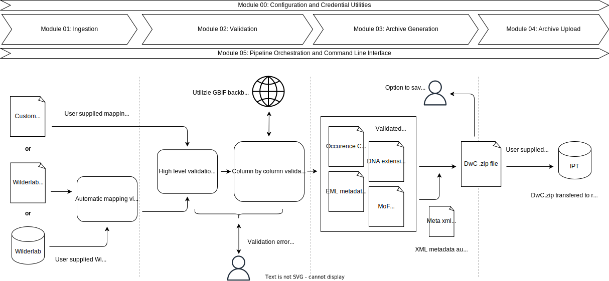

# eDNABridge 

<div style="font-size: smaller; width: 80%;"> 
This package was designed and developed by Epi (https://www.epi.group/) with funding provided by the New Zealand Ministry for the Environment. Support was provided by Wilderlab, the Hawke's Bay Regional Council, Department of Conservation and NIWA. 
</div>

This R package provides functions to facilitate the transformation of environmental DNA (eDNA) occurrence data into the Darwin Core Archive (DwC-A) format and publishing via the Global Biodiversity Information Facility (GBIF) Integrated Publishing Toolkit (IPT). It is aimed to be an end-to-end workflow primarily focused for holders of eDNA data looking for more automated solutions to publishing eDNA data to GBIF.

## Features

*   The workflow can be run:
    *   **Interactively** via a terminal session with prompts.
    *   **Programmatically** by calling functions with parameters in your own R scripts.
*   Data can be exported and re-imported at various stages. Primary output is the DwC-A archive, but intermediate data frames can also be exported for advanced users.

### Overview of modules



### 1. Source eDNA Occurrence Data

*   Import data directly from Wilderlab using their API (requires user authentication).
*   Load data from CSV files in Wilderlab’s multi-file format.
*   Load data from a single CSV files with user-specified column mappings.

### 2. Validate and Clean Data

*   Rename columns to match Darwin Core terms using:
    *   Default mappings for Wilderlab data.
    *   User-supplied mappings.
*   Check for required columns and validate data types.
*   Standardise taxonomic names using GBIF’s backbone taxonomy.
*   Suggest recommended GBIF fields if missing.
*   Generate a summary report highlighting issues and data completeness.

### 3. Generate a Darwin Core Archive (DwC-A)

Create a fully compliant DwC-A `.zip` file, including:

*   **Core occurrence file** (CSV).
*   Optional **Extended Measurement or Facts file** (CSV).
*   Optional **DNA extension file** (CSV).
*   **Meta file** (XML) describing file structure and term mappings.
*   **EML metadata file** (XML) with dataset, sampling, and author details.

### 4. Upload to IPT

*   Upload the DwC-A archive directly to a user-specified IPT instance using credentials and URL.
*   Supports IPT configurations where datasets are either published immediately or require admin review.

## Installation

You can install the development version of eDNABridge from GitHub with:

```r
# install.packages("devtools") # if not already installed
devtools::install_github("gbif/eDNABridge")
```

Or install the released version from CRAN with:

```r
install.packages("eDNABridge")
```

## Example Usage

An example workflow using eDNABridge, with intermediate level of control over each step.

This example uses functions from a module to ingest data from [Wilderlab](https://wilderlab.co/), an eDNA service provider in New Zealand. A custom data ingestion function can be used to load data from other sources.

```r
# Most steps require an internet connection

library(eDNABridge)
library(dplyr)

## Step 1: Ingest data from Wilderlab -----------------------------
# Terminal will prompt for API keys if not in .Renviron
# In this example, all data from an account is published at once
# See vignette("upload_workflow") for more detailed examples
# and recommendations for sample stratification before publishing.
ingested_data <- wl_get_all_wilderlab_data() |>
  wl_map_wilderlab_data() |>
  wl_inject_dwc_wilderlab_constants()

## Step 2: Validate and clean data --------------------------------
# Tibble contains various issues at error, warning or info levels
# Stop execution if any error-level issues are found, as later steps
# will likely fail or produce invalid output.
issues <- val_validate_all_fields(ingested_data)
if (nrow(issues |> filter(error_level == "error")) > 0) {
  stop("Data validation issues detected. Please resolve before proceeding.")
}

## Step 3: Generate DwC-A archive ---------------------------------
# Here we generate a DwC-A with only the occurrence core.
# Extended Measurement or Facts and DNA extension files can also be added.
dwc_tibbles <- gen_tibble_to_dwc_frames(ingested_data)

# Additional eml_* functions are required to make a valid EML file
# See vignette("eml_files") for more details.
eml_xml <- eml_base() |>
  eml_set_title("Example eDNA Dataset")

meta_xml <- meta_xml_base() |>
  meta_xml_add_file(
    type="core",
    df=dwc_tibbles$occurrence_core,
    location="occurrence_core.txt",
  )

gen_make_dwc_archive(
  dwc_tibbles = dwc_tibbles,
  eml_xml = eml_xml,
  meta_xml = meta_xml,
  path = "dwc_archive.zip"
)

## Step 4: Upload to IPT -------------------------------------------
# Terminal will prompt for IPT credentials if not in .Renviron
ipt_upload_and_publish(
  archive = "dwc_archive.zip",
  ipt_url = "https://your.ipt.instance.org/"
)
```