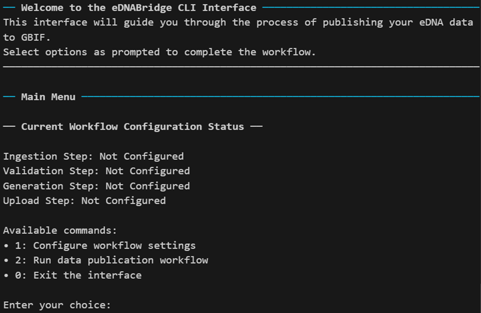

```{r, include = FALSE}
knitr::opts_chunk$set(
  collapse = TRUE,
  comment = "#>"
)
```

```{r setup}
library(eDNABridge)
```

# Introduction

To publish a biodiversity dataset on GBIF, you require the following components:

1. A core data file, which in this package is always a data file describing occurrences
2. Additional files that support the occurrence data file and extend it with more information
3. An Ecological Metadata Language (EML) file that describes the dataset
4. A metadata file (XML) that describes format of the core and extension data files

The core and extension data files must be tabular, with the correct columns present and errors handled prior to upload. 

This package provides functions that assist the end-to-end process of sourcing, cleaning, validating, packaging and uploading eDNA data. A guided workflow with terminal prompts is available, or exposed intermediately level functions can be used to craft customised R workflows.

## Command Line Interface

The command line interface (CLI) provides a guided workflow that prompts the user for information at each step. This is the easiest way to get started with publishing eDNA data to GBIF, and is recommended for users who are not yet familiar with the underlying functions.

```r
# Start the CLI
eDNABridge()
```



The CLI will guide you through configuring each step of the workflow, and then execute the workflow according to the steps you have configured. Enter the corresponding numbers to select options, and type in any required text when prompted.

Currently, the CLI supporting uploading a single dataset without stratification by any other factors (e.g. year, location). When sourcing Wilderlab data, only public samples in your account will be uploaded. To do something different, a customized R scripting workflow should be created using the tools discussed below.

## Customised R scripting workflow

The following sections describe the main steps in the eDNA to GBIF publishing workflow, and the main functions that support each step. These functions can be combined in a custom R script to suit your specific needs. Each function is prefixed with a short code indicating its purpose:

- wl_* : Wilderlab data ingestion and mapping functions
- val_* : Data validation functions
- eml_* : EML file creation functions
- meta_* : Metadata XML file creation functions
- gen_* : General functions for Darwin Core Archive creation and data frame manipulation
- ipt_* : IPT upload functions
- config_* : Configuration functions for setting API keys and other options

### 1. Data Ingestion from Wilderlab

wl_* functions related to data ingestion from the Wilderlab API. Where applicable, these functions will request that you enter your Wilderlab API keys into the terminal. These keys are not stored, unless you choose to store them in your .Renviron file when prompted. The .Renviron is kept locally and the package does not transmit or store your keys in any other way, other than via the actual API calls to Wilderlab itself.

When this is completed, you can get individual tables from the Wilderlab API via `wl_get_wilderlab_data()`, or get all tables associated with your account at once via `wl_get_all_wilderlab_data()`. The results should be the same as expected if you use the `wilderlab` package, see [here](https://wilderlab.co/api-instructions) for more details. Records are joined into a single table.

```r
# NEVER HARD CODE YOUR KEYS IN PRACTICE, utilize the caching or call these 
# functions manually to set your keys securely
# And remember to add .Renviron to your .gitignore if using version control
config_set_wilderlab_creds(
  wilderlab_key = "***",
  wilderlab_secret = "********",
  wilderlab_xapikey = "********",
  cache = FALSE
)

wilderlab_data <- wl_get_all_wilderlab_data()
print(names(wilderlab_data))
# [1] "jobs"    "samples" "taxa"    "records"

wilderlab_data$records |>
  head(n=2) |>
  print()
# # A tibble: 2 × 8
#        HID    UID TaxID Rank  Name       CommonName Group    Count
#      <dbl>  <dbl> <dbl> <chr> <chr>      <chr>      <chr>    <dbl>
# 1 48986915 101622    10 genus Cellvibrio NA         Bacteria   206
# 2 48988390 101623    10 genus Cellvibrio NA         Bacteria   183
```

Once obtained, the data is processed and mapped to Darwin Core terms. The tables are joined together into a single frame, to support validation in the next step.

```r
mapped_dwc_data <- wilderlab_data |>
  wl_map_wilderlab_data() |>
  wl_inject_dwc_wilderlab_constants() # Adds constant fields like basisOfRecord = "MaterialSample"
mapped_dwc_data |>
  head(n=2) |>
  print()
# # A tibble: 2 × 20
#   occurrenceID eventID eventDate  scientificName taxonRank taxonID
#          <dbl>   <dbl> <date>     <chr>          <chr>       <dbl>
# 1     48986915  101622 2024-07-17 Cellvibrio     genus          10
# 2     48988390  101623 2024-07-17 Cellvibrio     genus          10
# # ℹ 14 more variables: organismQuantity <dbl>, decimalLatitude <dbl>,
# #   decimalLongitude <dbl>, kingdom <chr>, phylum <chr>, class <chr>,
# #   order <chr>, family <chr>, genus <chr>, species <chr>,
# #   basisOfRecord <chr>, organismQuantityType <chr>, sampleSizeValue <dbl>,
# #   sampleSizeUnit <chr>
```

Alternatively, data can be exported for processing elsewhere.

```r	
wl_export_wilderlab_data(
  wilderlab_data,
  path = "folder/to/save/files",
)
# Saves four CSV files: jobs.csv, samples.csv, taxa.csv, records.csv
```

### 2. Data Cleaning and Validation

This package provides both high level functions for checking for the absence of particular Darwin Core terms, as well as column-by-column validation using customised rules. This validation is handled by a number of internal field validator classes that are called when a column matches a given Darwin Core term that is supported by the package. If the term is not supported, the package will fallback to basic value presence/absence validation checks. All functions return rows of a tibble in a standard format, with the term name, error level, issue description, row index and value.

```r
# Example of validating an occurrence data frame
# The dataset used only complies with required terms, so warnings will be issued for
# missing recommended and preferred terms
mapped_dwc_data |>
  val_validate_dwc_to_level("preferred") |>
  print()
# # A tibble: 8 × 5
#   term                          error_level issue                  index value
#   <chr>                         <chr>       <chr>                  <lgl> <lgl>
# 1 countryCode                   warning     missing recommended D… NA    NA   
# 2 geodeticDatum                 warning     missing recommended D… NA    NA   
# 3 coordinateUncertaintyInMeters warning     missing recommended D… NA    NA   
# 4 individualCount               warning     missing recommended D… NA    NA   
# 5 informationWithheld           warning     missing preferred Dar… NA    NA   
# 6 dataGeneralizations           warning     missing preferred Dar… NA    NA   
# 7 eventTime                     warning     missing preferred Dar… NA    NA   
# 8 country                       warning     missing preferred Dar… NA    NA  

mapped_dwc_data |>
  val_validate_all_fields() |>
  dplyr::filter(error_level == "error") |>
  print()

# # A tibble: 0 × 5
# # ℹ 5 variables: term <chr>, error_level <chr>, issue <chr>, index <int>,
# #   value <chr>
```

For the following sections, we will assume that the data has been fully validated and is ready for packaging.

### 3. EML and Metadata File Creation

EML files can be created using high level functions that ensure all compulsory fields for GBIF upload are filled out. See the vignette on [EML file creation](eml_files.html) for more details.

```r
# For brevity, showing the template approach here
eml_gbif_template_create("template.csv")
# Fill out the template.csv file with appropriate details
eml <- eml_gbif_template_read("template.csv")
```

The metadata XML file can be created using the meta_* functions, by piping the `meta_base()` object through multiple `meta_xml_add_file()` calls to add the core and extension data files. These will add the column by column descriptions automatically based on the data frames provided and the latest Darwin Core schema fetched from GBIF at the time of the function call. By default, these files assume that the data files are tab delimited text files with a .txt extension, which downstream functions create automatically.

Before using these functions, we split the mapped and validated data into core and extension data frames.

```r
dwc_frames <- mapped_dwc_data |>
  gen_tibble_to_dwc_frames()
```

Then we can create the metadata XML file.

```r
# This example technically only has an occurrence core, but we'll show adding an extension too
names(dwc_frames)
# [1] "occurrence_core" "dna_extension" "mof_extension"

# To find the row type URIs, see:
# https://rs.gbif.org/core/?C=M;O=D - for core types
# https://rs.gbif.org/extension/gbif/1.0/?C=M;O=D - for DNA DerivedData extension
# https://rs.gbif.org/extension/dwc/?C=M;O=D - for MeasurementOrFact extension

meta <- meta_xml_base() |>
  meta_xml_add_file(
    type = "core",
    df = dwc_frames$occurrence_core,
    location = "occurrence.txt",
    rowType = "http://rs.tdwg.org/dwc/terms/Occurrence",
  ) |>
  meta_xml_add_file(
    type = "extension",
    df = dwc_frames$dna_extension,
    location = "dna_extension.txt",
    rowType = "http://rs.gbif.org/terms/1.0/DNADerivedData",
  ) |>
  meta_xml_add_file(
    type = "extension",
    df = dwc_frames$mof_extension,
    location = "mof_extension.txt",
    rowType = "http://rs.tdwg.org/dwc/terms/MeasurementOrFact",
  )

print(meta)
# {xml_document}
# <archive metadata="eml.xml" xmlns="http://rs.tdwg.org/dwc/text/">
# [1] <core encoding="UTF-8" fieldsTerminatedBy="\\t" linesTerminatedBy="\\n" ...
# [2] <extension encoding="UTF-8" fieldsTerminatedBy="\\t" linesTerminatedBy= ...
# [3] <extension encoding="UTF-8" fieldsTerminatedBy="\\t" linesTerminatedBy= ...
```

### 4. Packaging and Uploading to GBIF

With the objects `dwc_frames`, `meta` and `eml`, we have everything we need to create a Darwin Core Archive and upload it to GBIF.

```r
gen_make_dwc_archive(
  dwc_frames = dwc_frames,
  meta = meta,
  eml = eml,
  path = "path/to/save/dwc_archive.zip",
)
```

The archives can either be uploaded to an IPT server manually, or the following functions can be used to provided a more automated experience. When uploading files in bulk, take care to follow recommendations from your IPT administrator about the best practices for organising and uploading datasets. For example, should a separate archive be made for each year of a given dataset? These considerations affect the ability for GBIF users to access data you publish.

```r
# You will be prompted for the URL of the IPT server, and you your credentials
# Again, these are not stored unless you choose to store them in your .Renviron file

resource_name <- "mydataset" # Unique shortname for the resource on the IPT server

ipt_login() |>
  ipt_upload_resource(
    archive = "path/to/save/dwc_archive.zip",
    shortname = resource_name,
  ) |>
  ipt_save_metadata(resource_name, org = "myorg") |> # Write your organisation as it appears in the IPT metadata menu
  ipt_set_visible(resource_name) |> # omit if you want the resource published privately
  ipt_publish_resource(resource_name) |> # omit if you do not wish to publish immediately
  ipt_register_resource(resource_name) # omit if you do not wish to register with GBIF immediately

# Alternatively, you can use the all-in-one function below
# You will need to set the organisation in the IPT manually afterwards if using this approach
# Resources will not be automatically registered with GBIF if using this approach
ipt_upload_and_publish(
  archive = "path/to/save/dwc_archive.zip",
  shortname = resource_name,
)
```